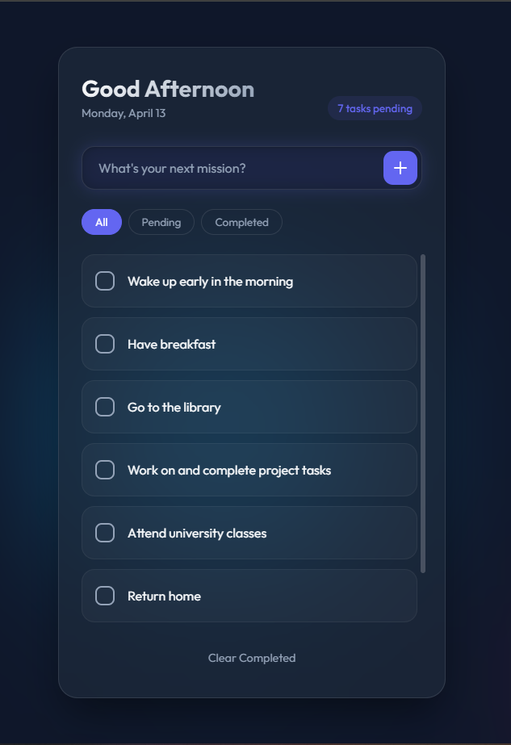

# ✨ Stellar Tasks

A stunning, modern, and highly interactive To-Do List web application designed with an emphasis on UI/UX, glassmorphism, and smooth animations.



## 🚀 Features
- **Glassmorphism Design:** Beautiful frosted-glass UI suspended over a dynamic, animated background context.
- **CSS Mesh Gradient:** An aurora borealis-styled fluid background providing deep and alive aesthetic appeal.
- **Butter-Smooth Animations:** Task elements elegantly slide, stagger, and beautifully transition upon interacting.
- **Filtering System:** Easily toggle views between All, Pending, and Completed statuses to locate your priorities quickly.
- **Persistent Storage:** Fully integrated with `localStorage` so your missions naturally persist across sessions and reloads.
- **Micro-Interactions:** Custom SVG iconography, active glow effects, and a clever "shake" animation to alert users to invalid input.

## 🛠️ Technology Stack
- **HTML5:** Semantic HTML foundations and embedded SVGs.
- **CSS3:** Advanced modern CSS (Variables, keyframes, backdrop filtering, Flexbox, media queries).
- **Vanilla JavaScript:** Clean, native, and dependency-free DOM manipulation and state management.

## 🎨 Getting Started

1. Clone or download this repository.
```bash
git clone https://github.com/YourUsername/To-Do-List-App.git
```
2. Navigate to the project directory.
3. Simply open `index.html` in any modern web browser to start organizing your life!

## 📂 Directory Structure

```text
/
├── index.html     # The core layout & markup
├── style.css      # Keyframe animations, root variables, UI styling
├── script.js      # App logic, local storage, dynamic DOM modification
└── images/        
    └── preview.png # App demonstration screenshot
```

---
*Transforming the simple To-Do standard into an extraordinary visual experience.*
